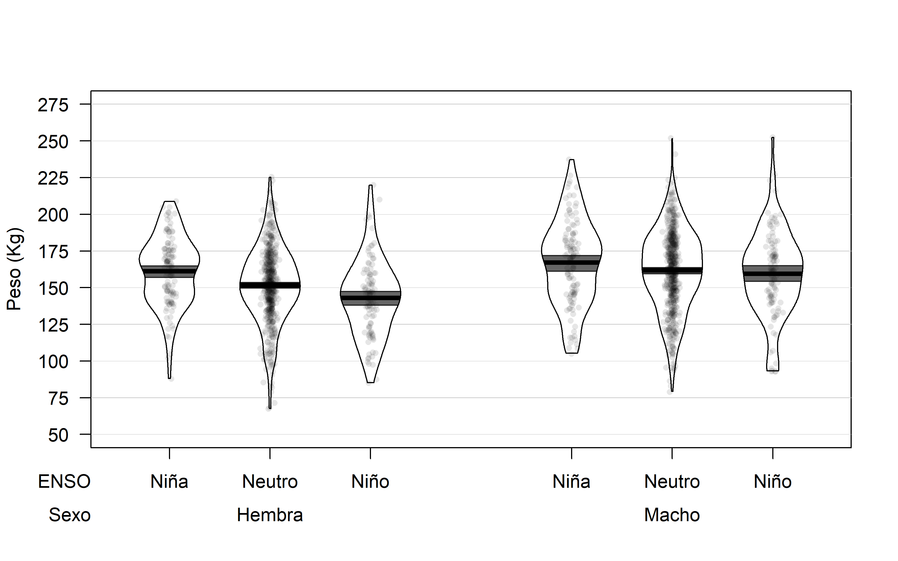

```{r setup, include=FALSE}
knitr::opts_chunk$set(echo = TRUE)
options(width = 1000)
```


Datos del Instituto Antartico Argentino     
Dr. Javier Negrete     
Enviados por Malena Pfoh    

Todos los analisis estan en esta direccion    
https://github.com/adbpatagonia/MLPesoCachorros    

graficos:     
https://raw.githubusercontent.com/adbpatagonia/MLPesoCachorros/master/output/Peso_Sexo_Evento.png       

https://raw.githubusercontent.com/adbpatagonia/MLPesoCachorros/master/output/ancovaplot.png


# Relacion de peso al destete con eventos de El Nino    

Malena envio datos de peso al destete de cachorros de *Mirounga leonina* y de potencia del ENSO para distintaas epocas del ano.    
Estas exploraciones fueron realizadas con la potencia media de marzo a agosto.    

## ENSO como medida discreta      

Se definio a eventos de ENSO de la siguiente manera: 

   * Nina: ENSO <= -0.5    
   * Neutro: -0.5 < ENSO < 0.5
   * Nino: ENSO => 0.5     
   
Modelo lineal general (i.e. ANOVA de 2 vias):

Peso al Destete ~  ENSO + sexo + ENSO * sexo,

donde ENSO * sexo representa la interaccion entre ENSO y sexo del cachorro    

```{r ANOVA interaccion, echo=FALSE}
   knitr::kable(anova(lm1), caption = 'Tabla de ANOVA para el modelo lineal incluyendo interaccion') %>%
      kable_styling("striped")
```

La interaccion no es significativa (p-value = `r round(anova(lm1)[3,5], 3)`)   
Entonces, descartarla y continuar solo con los efectos principales      

```{r ANOVA , echo=FALSE}
   knitr::kable(anova(lm2), caption = 'Tabla de ANOVA para el modelo lineal excluyendo interaccion') %>%
      kable_styling("striped")
```

Ambos efectos principales son significativos a un nivel de $\alpha$ de 5%.    


Valores de los parametros del ANOVA de 2 vias (con intervalo de confianza del 95%): 
```{r ANOVA params, echo=FALSE}
   knitr::kable(data.frame(paramvalue = coefficients(lm2), confint(lm2))) %>%
      kable_styling("striped")
```
 
 Es decir,    
  * en promedio los machos pesan 10 kg mas que las hembras  
  * en promedio, en anos neutros los cachorros pesan 7.4 kg menos que en anos de nina   
  * en promedio, en anos de nino los cachorros pesan 12.8 kg menos que en anos de nina    

Intercept es el valor para hembras en anos nina       
Para obtener el valor apra hembras en anos neutros, tenes que sumar Intercept + evento.maNeutro, es decir: 158.887577 - 7.381559	= 151.506      
Para obtener el valor apra hembras en anos nino, tenes que sumar Intercept + evento.maNino, es decir: 158.887577 - 12.772576	= 146.115      
Para obtener el valor apra machos en anos nina, tenes que sumar Intercept + sexoMacho, es decir: 158.887577 + 10.345465	= 169.233     
Para obtener el valor apra machos en anos neutro, tenes que sumar Intercept + sexoMacho + evento.maNeutro, es decir: 158.887577 + 10.345465 - 7.381559	= 161.8515    
Para obtener el valor apra machos en anos nina, tenes que sumar Intercept + sexoMacho + evento.maNino, es decir: 158.887577 + 10.345465 - 12.772576	= 156.4605     


### Pirate Plot    

EN este grafico se visualizan 4 elementos:    

  1. datos (puntos)    
  2. distribucion de los datos (violin plot)     
  3. medida de tendencia central (linea negra)     
  4. intervalo de inferencia, en este caso 95% Bayesian Highest Density Interval. Si los intervalos se solapan, las diferencias no son significativas, y lo son si estos no se solapan.    
  
  Para una descripcion completa de este tipo de graficos, mirar aca   
  https://cran.r-project.org/web/packages/yarrr/vignettes/pirateplot.html  
  
  
  
  
  Estos son los valores que definen a este grafico 
  
```{r pirate plot data , echo=FALSE}
   knitr::kable(as.data.frame(dat)) %>%
      kable_styling("striped")
```

Los valores de esta tabla no coinciden perfectamente con los parametros del ANOVA xq se obtuvieron x diferentes metodos, pero son consistentes.    


## ENSO como medida continua     

explore utilizar los datos de ENSO como medida continua, en lugar de caracterizarlo como Nina, Neutro, Nino
  
Modelo lineal general    
Peso al Destete ~  ENSO + sexo + ENSO * sexo,      

como en este caso ENSO es continuo, esto se llama ANCOVA (1 variable independiente continua 1 una discreta)

```{r ANCOVA interaccion, echo=FALSE}
   knitr::kable(anova(ancova.int), caption = 'Tabla de ANOVA para el modelo lineal incluyendo interaccion') %>%
      kable_styling("striped")
```

*acalaracion:* en la tabla de ANOVA la variable ENSO aparace como "potencia.mar.agos"         

La interaccion no es significativa (p-value = `r round(anova(ancova.int)[3,5], 3)`)   
Entonces, descartarla y continuar solo con los efectos principales      

Esto quiere decir que las lineas de regresion de machos y hembras son perfectamente paralelas.   

```{r ANCOVA , echo=FALSE}
   knitr::kable(anova(ancova), caption = 'Tabla de ANOVA para el modelo lineal excluyendo interaccion') %>%
      kable_styling("striped")
```

Ambos efectos principales son significativos a un nivel de $\alpha$ de 5%.    

```{r ANCOVA params, echo=FALSE}
   knitr::kable(data.frame(paramvalue = coefficients(ancova), confint(ancova))) %>%
      kable_styling("striped")
```
 
 
 Es decir, que los machos son alrededor de 10 kg maspesados que las hembras, y que el ENSO tiene un efecto negativo en el peso al destete.   


```{r ANCOVA plot, echo=FALSE, warning=FALSE}
   ggplotly(ancovaplot)
```

# Caveat      

Los valores de p-value son muy bajos por la cantidad de datos, que son muchos. Los valores de p-value son funciones directas del tamano muestral. Cuando se tienen muchos datos es altamente probable que las relaciones que se encuentren sean significativas. Ojo, esto no quiere decir que no sean reales (de hecho, fijate que las interacciones fueron no significativas). Esto quiere decir que hay que ser cuidadosos al presentar los valores y no leer de mas en el valor tan bajo de p-value.    

# Conclusiones    

Personalmente me satisface mas el primer analisis, en el que se considera al ENSO como variable discreta.      
De todos modos, ambos analisis apuntan a las mismas conclusiones:   
  
  1. El ENSO influye en el peso de los cachorros al destete     
   a. SI  consideramos al ENSO como discreto, los pesos son  Nina > Neutro > Nino    
   b. Si consideramos al ENSO como continuo, el ENSO tiene un efecto negativo sobre el peso al destete    
  2. Los machos son mas pesados que las hembras al destete (esto no es nuevo, pero estamos controlando el ruido que esto potencialmente podia introducir en la relacion de peso con ENSO)     
  
# Software utilizado  

para los analisis de modelos lineales generales use la funcion `lm()` del paquete `base()` de R Statistical Language  (@Rpk)       
para el grafico de ANCOVA use el paquete `ggplot2` (@ggplot2pk)    
para el pirate plot use la funcion `pirateplot()` del paquete `yarrr` (@yarrrpk)

# Referencias 
