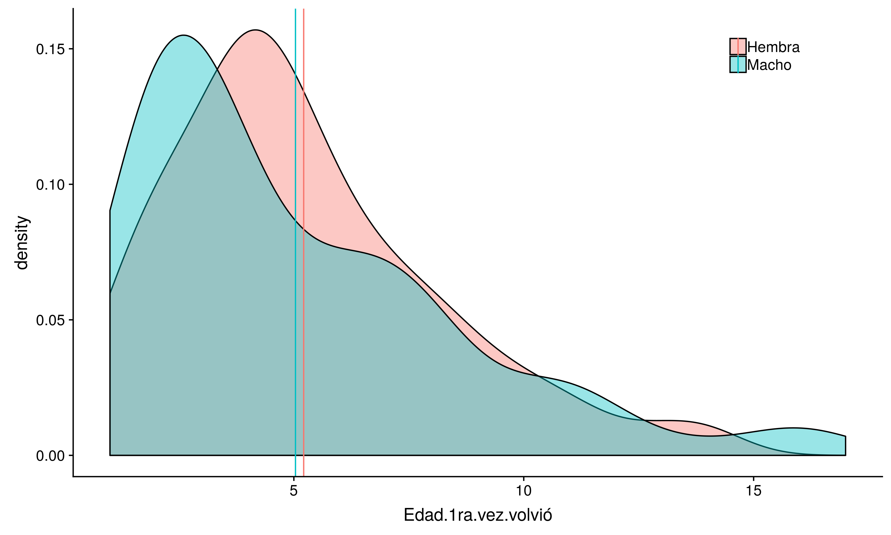
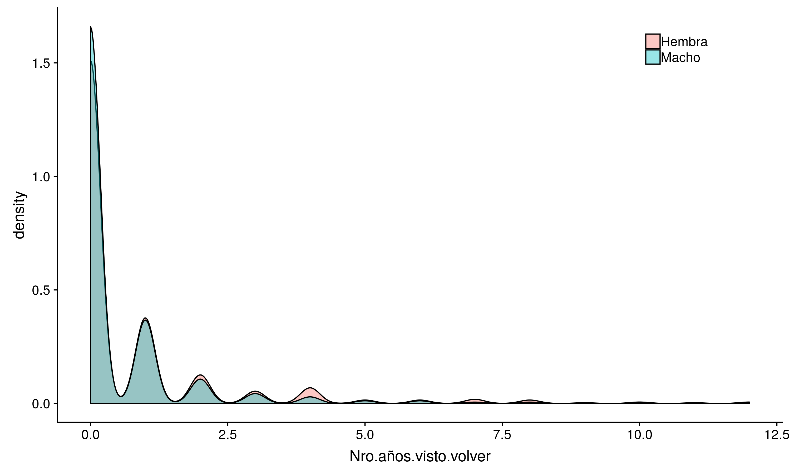
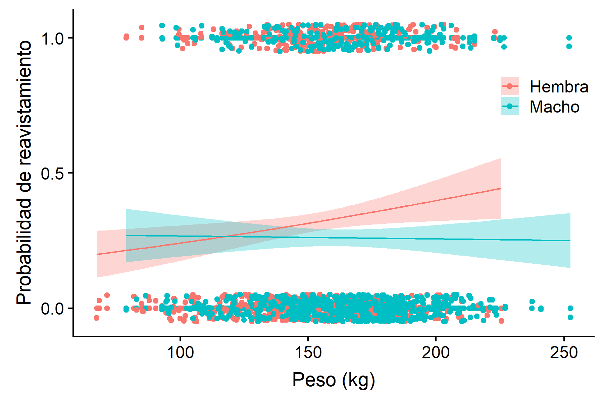
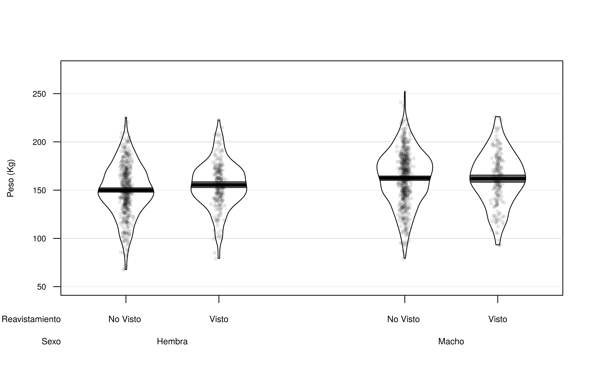

```{r setup, include=FALSE}
knitr::opts_chunk$set(echo = TRUE)
options(width = 1000)
```


Datos del Instituto Antartico Argentino     
Dr. Javier Negrete     
Enviados por Malena Pfoh    

Todos los analisis estan en esta direccion    
https://github.com/adbpatagonia/MLPesoCachorros    

graficos:     

https://raw.githubusercontent.com/adbpatagonia/MLPesoCachorros/master/output/Distribucion_Edad_Primer_Reavistamiento.png   
https://raw.githubusercontent.com/adbpatagonia/MLPesoCachorros/master/output/Distribucion_N_Reavistamiento.png     
https://raw.githubusercontent.com/adbpatagonia/MLPesoCachorros/master/output/Peso_Reavistamiento_Sexo.png    
https://raw.githubusercontent.com/adbpatagonia/MLPesoCachorros/master/output/ProbAvist_Sexo_Peso.png    
  


# Probablidad de reavistamiento de acuerdo al sexo y peso al destete  

El objetivo inicial de la pasantia era analizar la supervivencia al primer ano de vida. Dado que los animales no regresan a  la colonia luego de un ano, esta tasa vital es imposible de calcular. Se pueden obtener estimaciones haciendo varios supuestos con tecnicas estadisticas avanzadas, e.j modelos de estado-espacio. El desarrollo y aplicacion de estos modelos escapa al alcance de la pasantia. Por ende, tenemos que simplificar el analisis. EL presente estudio analiza si la probabilidad de reavistar un animal depende del sexo y del peso al destete del animal. *Nota:* llamamos probabilidad de reavistamiento y no de supervivencia dado que no tenemos la certeza de que un animal que no fue reavistado haya muerto.    


# Edad al primer reavistamiento     

Las distribuciones de frecuencia de las edades a las cuales se reavisto por primera vez a los animales es muy similar entre machos y hembras    
 

Al igual que las distribuciones de frecuencia del nro de anos que se vio volver a los animales     


La edad media a la que se reavisto por primera vez a los animales fue:  

```{r mafr, echo=FALSE}
   knitr::kable(mafr, ) %>%
      kable_styling("striped")
```

 Hay datos de marcado hasta el 2018, pero los animales que fueron marcados en anos recientes no han tenido una oportunidad 'justa' de ser reavistados. Entonces, para los analises de regresion logistica utilice datos hasta el 2013 para evitar que la alta proporcion de animales no reavistados que fueron marcados post 2013 tengan influencia en los resultados.    
 
 
# Regresion logistica    

Aqui analizamos si la probabilidad de reavistar un animal depende de su sexo y del peso al destete. Definimos:   

  * Exito: si el animal fue reavistado, independientemente de cuantas veces haya sido reavistado     
  * Fracaso: si el animal nunca fue reavistado      
  
Entonces, cada animal queda definido como 'exito' o 'fracaso' y podemos modelar la proporcion de exitos como #exitos/(#exitos+#fracasos). Estos casos son definidos por una distribucion Bernoulli, y por ende el analisis correspondiente es el de regresion logistica (tambien se lo puede definir como modelo lineal generalizado con distribucion binomial y funcion link logit).   

La estrategia consiste en ajustar los siguientes 2 modelos:    

  * reavistamiento ~ sexo + peso + sexo * peso     
  * reavistamiento ~ sexo + peso    
  
donde peso es peso al destete.     
El primer modelo incluye una interaccion entre sexo y peso, lo que significa que la forma en la cual varia la probabilidad de reavistamiento con el peso al destete depdende del sexo. Si esto fuese una regresion lineal, se podria interpretar a la existencia de interaccion como una falta de paralelismo entre las curvas de respuesta de hembras y machos.   
EL segundo modelo no incluye dicha interaccion. 
Ajustamos los dos modelos y analizamos si el icluir la interaccion aporta significativamente a una mejoria del ajuste del modelo. Hay diferentes maneras de analizar esto. No estoy seguro que tan versada estas en estas tecnicas, por lo que te envio 2 tablas difrentes:    

  * Analisis de ANOVA, tipo III
  * prueba de razón de verosimilitud (likelihood ratio test)    
  
Los resulados son identicos, de manera que solo tenes que presentar una - presenta la que te sientas mas comoda explicando.    

```{r ANOVA, echo=FALSE}
   knitr::kable( car::Anova(glm1, type = 'III', test.statistic = 'F'), caption = 'Tabla de ANOVA tipo III') %>%
      kable_styling("striped")
```

```{r LRT, echo=FALSE}
   knitr::kable( drop1(glm1, test = "LRT"), caption = 'Likelihood Ratio Test') %>%
      kable_styling("striped")
```


EN ambos casos la interaccion sexo:peso es significativa, lo que significa que el incluirla en el modelo mejora el ajuste por lo cual hay que retenerla.  Aqui es donde se termina la exploracion de inclusion de terminos en el modelo. Ahora debes presentar los parameteros del modelo reavistamiento ~ sexo + peso + sexo * peso. EN la siguiente tabla estan los valores de los parametros con su correspondiente intervalo de confianza (95%)   

```{r params, echo=FALSE}
   knitr::kable( suppressMessages(cbind(coef(glm1), confint(glm1))), caption = 'Valores de los parametros con intervalos de confianza del 95% del modelo reavistamiento ~ sexo + peso + sexo * peso') %>%
      kable_styling("striped")
```


Una vez presentados los parametros podemos visualizar las relaciones entre sexo al destete y probabilidad de reavistamiento, por sexo. EN este grafico, los puntos que estan alineados en 1 representan exitos, lo puntos que estan alineados en 0 representan fracasos, y las lineas representan la probabilidad de reavistamiento esperada (con intervalos de confianza del 95% - las zonas sombreadas).    

Es decir que la probabilidad de reavistamiento:   
   
   * aumenta con el peso al destete en hembras    
   * es independiente del peso al destete en machos    
   
   




# Pirate Plot    

EN este grafico se visualizan 4 elementos:    

  1. datos (puntos)    
  2. distribucion de los datos (violin plot)     
  3. medida de tendencia central (linea negra)     
  4. intervalo de inferencia, en este caso 95% Bayesian Highest Density Interval. Si los intervalos se solapan, las diferencias no son significativas, y lo son si estos no se solapan.    
  
  Para una descripcion completa de este tipo de graficos, mirar aca   
  https://cran.r-project.org/web/packages/yarrr/vignettes/pirateplot.html  
  
  

  Estos son los valores que definen a este grafico 
  
```{r pirate plot data , echo=FALSE}
   knitr::kable(as.data.frame(dat)) %>%
      kable_styling("striped")
```

Este grafico repreenta exactamente los mismos datos que presentamos en la regrssion logistica, solo que a mi gusto hace un poco mas claro de donde surjen las difrencias. Fijate que las bandas sombreadas no se solapan para hembras, mientras que si se solapan para machos.   


# Caveat      

Los valores de p-value son  bajos por la cantidad de datos, que son muchos. Los valores de p-value son funciones directas del tamano muestral. Cuando se tienen muchos datos es altamente probable que las relaciones que se encuentren sean significativas. Ojo, esto no quiere decir que no sean reales . Esto quiere decir que hay que ser cuidadosos al presentar los valores y no leer de mas en el valor  bajo de p-value. Fijate que la diferencia entre peso medio de hembras vistas y no vistas es de tan solo 155.4276 kg - 149.9917 kg = 5.4359 kg

# Conclusiones    

  
  
  1. El  peso de los cachorros al destete influye en la probabilidad de reavistar al animal de manera diferente entre hembras y machos:    
   a. la probabilidad aumenta con el peso al destete en hembras    
   b. la probabilidad es independiente del peso al destete en machos    
  
# Software utilizado  

para los analisis de regresion logistica use la funcion `glm()` del paquete `stats` de R Statistical Language  (@Rpk)       
para los graficos use el paquete `ggplot2` (@ggplot2pk)    
para el pirate plot use la funcion `pirateplot()` del paquete `yarrr` (@yarrrpk)

# Referencias 
